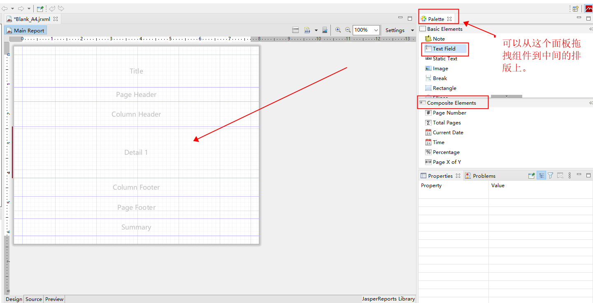

# 报表模板制作

## 开发步骤

### 1. 打开 Jaspersoft Studio 切换工作目录。


### 2. 创建模板


### 3. 配置 JSON 数据源

数据源是多行的一组数据。
下面的示例是选取了 JSON 文件的 "数据列表" 节点作为数据源。

```json
{
    "概要": {
        "标题": "一个标题",
        "时间": "2020-01-01",
        "数字": 123456
    },
    "数据列表": [
        {
            "名字": "名字A",
            "编号": "101",
            "图片": "https://www.baidu.com/img/flexible/logo/pc/result.png"
        },
        {
            "名字": "名字B",
            "编号": "102",
            "图片": "https://www.baidu.com/img/flexible/logo/pc/result.png"
        },
        {
            "名字": "名字C",
            "编号": "103",
            "图片": "https://www.baidu.com/img/flexible/logo/pc/result.png"
        }
    ]
}
```





### 4. 添加参数


